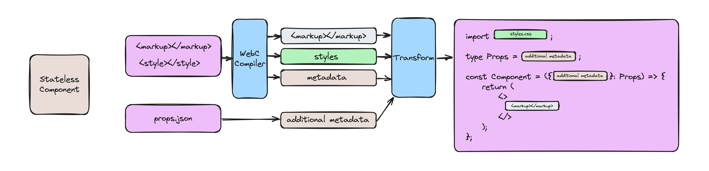
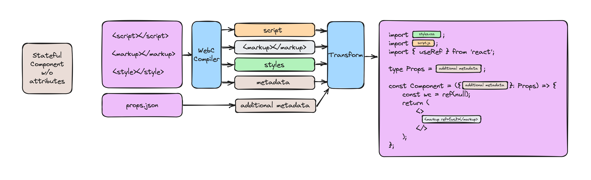
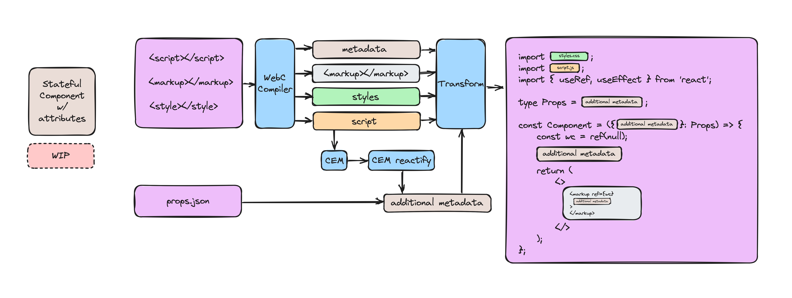

# WebCC

This is a compiler on top of the [WebC](https://github.com/11ty/webc) compiler, that can be used to author single file components in WebC and then port them to be used in other UI frameworks like React, Vue, SolidJS and Astro. The motivation behind this project is leverage the advantages of WebC over the Web Component standards, so the components can work in an SSR context as well. This is because WebC offers a powerful way to share markup, and when you use that as a mechanism to generate React components, for example, this works well with SSR.

The workflow for component development would be to author it using WebC, test it on a officially supported platform like 11ty, run it through the compiler and you get a framework component very similar to how you would've written it. This will be true for presentational, or stateless, components. For components with dynamic behavior, you would declare it as a custom element and that's what will drive the state and behavior of the component. I aim for this to be a very simple code splitting and splicing project and will not have the sophistication or complexity of a project like [Mitosis](https://github.com/BuilderIO/mitosis).  

## WebCC Architecture

### Stateless WebC component to React Component 

The transformation here is pretty straightforward. The WebC compiler outputs the markup and styles (the metadata is only for the name of the component) as strings and that gets appended as is to a React boilerplate component. Currently, props are supported by including an additional file alongside the component that defines it. I'm working on automating this, and it's not supported currently because I don't understand how to get this out of the WebC compiler.

### Stateful WebC component without attributes being transformed to React Component

The transformation here is a little more involved than a stateless component. The WebC compiler also outputs the script as a string and that too gets appended to the React boilerplate component. For a custom element to work in React, a `ref` is created and added to the markup.

### [WIP] Stateful WebC component with attributes being transformed to React Component

This is currently only an idea/plan and I'm still researching how to get this working. Progress on this can be tracked in this ticket:

- https://github.com/hasanhaja/webcc/issues/5

## Planned exploration

- [x] React presentational components
- [x] Basic code generation and wiring for CSS and JS
- [x] Simple React wrapper for custom elements
- [x] Simple CLI interface
- [x] Debugging option for the CLI interface
- [ ] Auto detection of WebC props and attributes
- [ ] Fully supported custom elements wrapper in React
- [x] Astro components
- [ ] Vue components
- [ ] Proper support for client components for React Server Components
